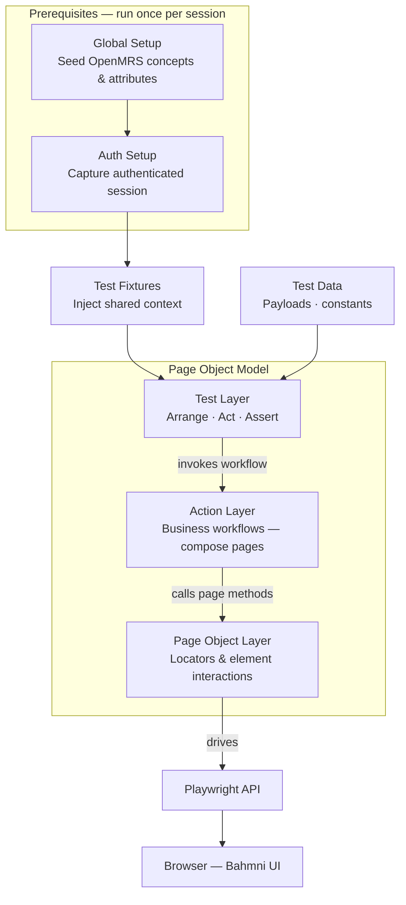
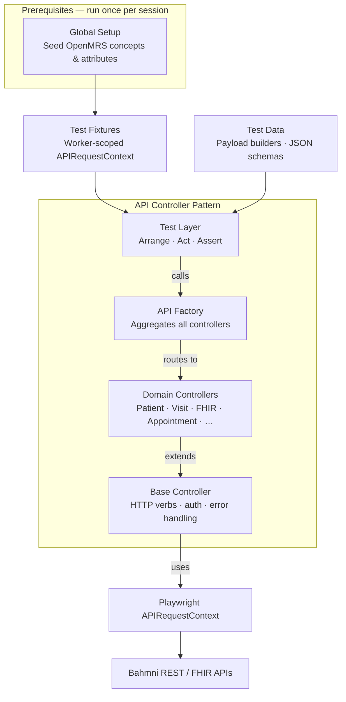

# Bahmni Test Automation

Automated test suite for Bahmni 3.0 — includes UI functional tests and API tests using Playwright.

## Prerequisites

- Node.js v18 or higher
- Docker (for running Bahmni locally)
- Bahmni instance running (local or remote)

## Installation

```bash
npm install
```

## Global Setup

The framework includes a global setup that runs before all tests to:

- Verify environment accessibility
- Create necessary concepts, attributes from openMRS which is required for the tests

These prerequisites are automatically created on first run and skipped on subsequent runs if they already exist.

## Project Structure

```
bahmni-test-automation/
├── src/
│   ├── api/                # API automation framework
│   │   ├── endpoints.ts    # REST and FHIR URL path constants
│   │   ├── controllers/    # Domain controllers (Patient, Visit, Location, FHIR)
│   │   ├── fixtures/       # API test fixture (worker-scoped)
│   │   ├── types/          # Request/response TypeScript interfaces
│   │   └── ApiFactory.ts   # Entry point — instantiates all controllers
│   ├── ui/                 # UI automation framework
│   │   ├── pages/          # Page Object Models
│   │   ├── actions/        # Business flow action layer
│   │   └── fixtures/       # UI test fixtures (clinical, appointment, document)
│   ├── config/             # Environment configuration (shared)
│   └── utils/              # Shared utilities (schema validator, API helpers)
├── tests/
│   ├── api/                # Standalone API test specs
│   │   ├── openmrs/        # OpenMRS REST API tests
│   │   └── fhir/           # FHIR R4 API tests
│   ├── e2e/                # End-to-end UI tests
│   └── module/             # Module-level UI tests
├── test-data/
│   ├── common/             # Shared test data (UI + API)
│   └── api/                # API-specific payloads, constants, schemas
├── playwright.config.ts
└── package.json
```

## Architecture

### UI Automation



**How the Page Object Model works here:**

- **Test Layer** knows nothing about locators. It calls an action (e.g. `clinicalActions.startConsultation(patient)`) and asserts on the observed state.
- **Action Layer** owns the business workflow. A single action may compose several page objects — e.g. registering a patient touches `LoginPage`, `HomePage`, and `CreatePatientPage`.
- **Page Object Layer** owns locators and low-level element interactions for one screen. A page object never asserts and never orchestrates other pages.
- **Playwright** is only touched inside page objects — actions and tests never call `page.click()` directly.

---

### API Automation



**How the API Controller Pattern works here:**

- **Test Layer** knows nothing about HTTP. It calls a controller method (e.g. `api.patient.create(payload)`) and asserts on `{ status, body }`.
- **API Factory** is the single entry point — it aggregates all domain controllers and shares one `APIRequestContext` across them.
- **Domain Controllers** own endpoint paths and request shapes for their domain. They expose typed methods and never format HTTP details.
- **Base Controller** owns HTTP verbs, auth headers, and error handling. `get / post / put / del` throw on non-2xx; `getRaw / postRaw / putRaw / delRaw` return `{ status, body }` without throwing — used for negative tests.
- Only the Base Controller touches Playwright's `APIRequestContext` — controllers and tests never build requests directly.

## Environment Configuration

The project supports multiple environments through `.env` files:

- `.env.local` - For local testing (https://localhost)
- `.env.dev` - For development environment

Create above files by using .env.example for your environment.

## SSL Certificate Setup for Local Testing

When testing against a local Bahmni instance with self-signed certificates, you need to extract and trust the SSL certificate.

### Step 1: Extract Certificate from Docker

```bash
docker exec bahmni-standard-proxy-1 cat /etc/tls/cert.pem > /tmp/bahmni-cert.pem
```

### Step 2: Add Certificate to macOS Keychain (macOS only)

```bash
sudo security add-trusted-cert -d -r trustRoot -p ssl -k /Library/Keychains/System.keychain /tmp/bahmni-cert.pem
```

**Note:** The certificate file must remain at `/tmp/bahmni-cert.pem` as the test scripts reference this path.

## Running Tests

### UI Tests

```bash
# Run all UI tests (local)
npm run test:local

# Run all UI tests (dev)
npm run test:dev

# Run with headed browser
npm run test:headed:local

# Run specific test file
npm run test:local -- tests/ui/module/clinical/consultation.spec.ts --project=chromium

# Run specific browser
npm run test:chromium
```

### API Tests

```bash
# Run all API tests
npm run test:api

# Run API tests (local with SSL cert)
npm run test:api:local

# Run specific API test file
npm run test:api -- tests/api/openmrs/registration.spec.ts
```

## Test Reports

Results are published to ReportPortal (see `infra/reportportal/README.md`). Playwright's built-in HTML and JSON reports are also written to `reports/html-report` and `reports/test-results.json`.

```bash
# Open the local HTML report
npm run report
```

## Code Quality

```bash
# Check for lint errors
npm run lint

# Fix lint errors automatically
npm run lint:fix

# Check code formatting
npm run format:check

# Format code
npm run format
```

## Troubleshooting

### SSL Certificate Errors on Local

If you see `TypeError: fetch failed` errors during global setup:

1. Verify the certificate is at `/tmp/bahmni-cert.pem`
2. Ensure Docker container is running: `docker ps | grep bahmni-standard-proxy`
3. Re-extract the certificate if needed
4. Verify `NODE_EXTRA_CA_CERTS` is set in the npm scripts

### Tests Fail to Connect

1. Check if Bahmni is running: `docker ps`
2. Verify BASE_URL in `.env` file matches your instance
3. Test direct access: `curl -k https://localhost` (for local) or `curl https://your-dev-url` (for dev)

## Contributing

1. Follow the existing code style (enforced by ESLint and Prettier)
2. Use data-test-id attributes for UI locators whenever possible
3. Write descriptive test names
4. API tests: one controller call per test, assert `{ status, body }`
5. Run `npm run lint:fix` and `npm run format` before committing

## License

ISC
